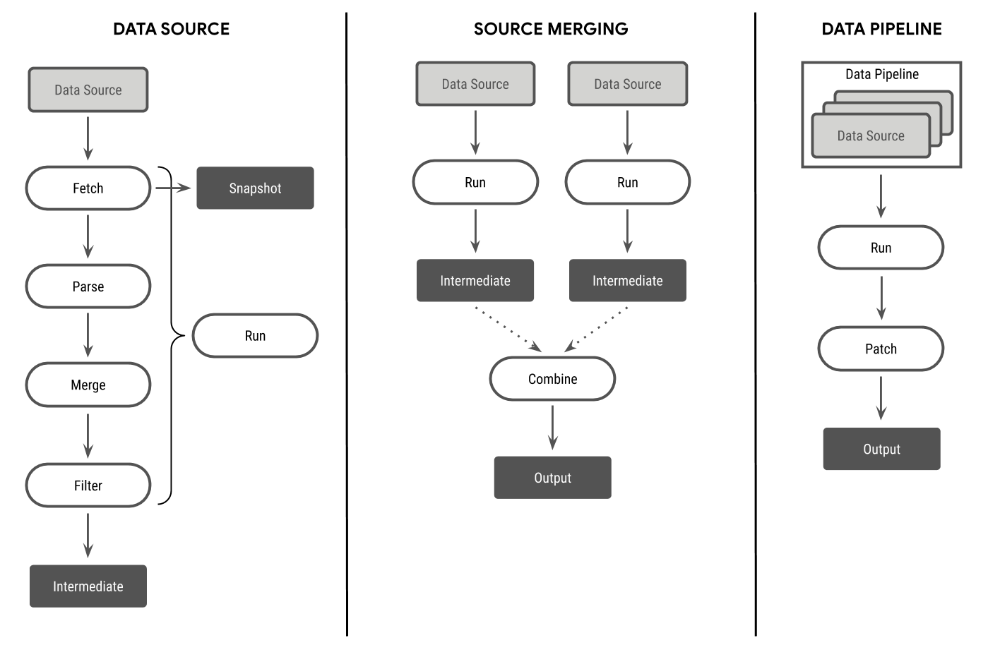
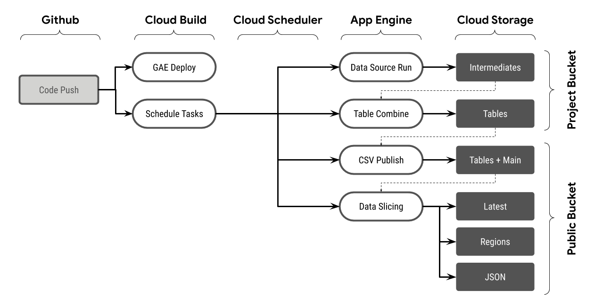

# Source Code
This folder contains all the code necessary to update the data tables. It is a single Python package
with the following modules:
* [data](./data): auxiliary and help data files used during processing of input
* [earthengine](./earthengine): submodule containing code used to perform computations in [Google Earth Engine](https://earthengine.google.com)
* [lib](./lib): core functions and utilities used across the package
* [pipelines](./pipelines): contains all the individual pipelines that produce the data tables
* [scripts](./scripts): collection of miscellaneous scripts, used only for manual processing
* [test](./test): unit testing of core functions

## Running
Data is automatically updated by the CI server on a schedule. To manually update the data for all
the data pipelines, execute the `update.py` script:
```sh
python update.py
```

To update a specific data pipeline, use the option `--only <comma_separated_names>`; for example:
```sh
python update.py --only index,demographics,geography
```

The update command will use the `output/tables` and `output/snapshot` folders at the root of the
project path. The raw data sources downloaded to produce outputs are placed under the `snapshot`
folder, and the processed data is placed in the `tables` folder.

Files in the `tables` folder are not meant to be used as-is. They are intended to be used for the
purpose of auditing changes in the dataset, being tracked by `git`. The files in the `tables` folder
are made available for general use after a [publishing step](#publish).

## Testing
To execute the unit tests, run the following command from this directory:
```sh
python -m unittest
```

## Contributing
### Existing Tables
To add new sources to be ingested into an existing table, please take a look to the epidemiology
table's [README](./pipelines/epidemiology/README.md) for step-by-step instructions. Even though it's
written in the context of adding new sources to the epidemiology table, the same advice applies
for any other table.

### New Tables
To create a new table output, it is recommended to start by making a copy of the
[_template](./pipelines/_template) folder. The name of the folder will determine the file name of the
output table, which will be placed under the output folder. Because of limitations with Python
imports, the folder name cannot use dashes (`-`). Instead, use underscores (`_`) which will be
replaced by dashes in the output table name.

## Architecture
### Data Source
Individual data sources are encoded as a `DataSource`. Each data source goes through the following
steps, executed in order:
1. Fetch: download resources into raw data
1. Parse: convert raw data to intermediate structured format
1. Merge: associate each record with a known `key`
1. Filter: filter out unneeded data and keep only desired output columns

The majority of the processing in a data source will likely take place in the `parse` step. All
individual records output by the data source have to follow the following guidelines:
* Each record **must** be matched with a known `key` present in the auxiliary
  [metadata table](./data/metadata.csv). Otherwise, it will be dropped from the output.
* Each record **may** include a `date` column, which must be ISO 8601 format (i.e. `YYYY-MM-DD`).

To make writing pipelines easier, a default implementation [`DataSource`](./lib/pipeline.py)
already includes a lot of the functionality that is likely to be used by a standard data parsing
routine, including downloading and conversion of raw resources into a pandas `DataFrame`. See the
[template source](./pipelines/_template/srcname_pipeline.py) for a trivial example which subclasses
the `DataSource` implementation.

### Data Pipeline
A `DataPipeline` object wraps a list of individual `DataSource`s and is defined in a `config.yaml`
file. Each data source is processed in order and the output is combined into a single data table.
When values for the same `key` (or, if present, `date`-`key` pair) overlap, the value present in the
last data source in the list is chosen. For example, if `source1` outputs `{key: AA, value: 1}` and
`source2` outputs `{key: AA, value: 2}`, then the combined output will be `{key: AA, value: 2}` --
assuming that `source2` comes after `source1` in the list. For this reason, you should order your
data sources from less trustworthy to more trustworthy, so the less trustworthy values can be
overwritten if more trusted data is available.

`DataPipeline` objects define the schema of the output table. Individual `DataSource` objects that
are part of the pipeline may output some or all columns defined in the schema, but columns not in
the schema will be filtered out in the final output.

### Data Flow Overview
The following diagram summarizes the data flow architecture:


### Google Cloud Infrastructure
This project can be run locally and therefore it is agnostic to any specific infrastructure, but it
makes use of several Google Cloud products to ensure robustness and continuous updates. Some of the
configuration files are checked in with the code, such as AppEngine's [app.yaml](./app.yaml) file.
This serves as a reference implementation for users of this code who might want to reproduce our
infrastructure setup. Here is a brief overview of the different Google Cloud products used as part
of this project:


### Google Earth Engine
Some data is computed using [Google Earth Engine](https://earthengine.google.com). The code used is
stored under the git submodule under [earthengine](./earthengine); you may need to sign in using
your Google account and request access via
[this link](https://earthengine.googlesource.com/new-password) to be able to clone the submodule.

## Publish
Data tables are made available for use via the `publish.py` script which uploads the files to a file
server and creates the different versions of the datasets (like date subsets, the main table, JSON
formatted files, etc.). Data is published automatically by the CI server with every change to the
main branch; to run the publish step locally, simply execute this script from the `src` directory:
```sh
python publish.py
```

## Caching
Some data sources are unreliable or only provide daily data (instead of historical). To improve the
resiliency of the data pipeline, you may also use a cache layer which creates hourly snapshots of
data sources, which can then be aggregated into historical data. URLs defined in the
[cache.yaml file](./cache.yaml) are downloaded automatically.

## Development Environment
There are no strict guidelines regarding a development environment. Here are the recommended
settings, which would help ensure consistency across the codebase.

### Python
Any python above 3.6 should be able to update and publish the data pipelines, provided the required
dependencies are met. The recommended approach is to install a virtual environment, like [conda][1],
and then install the dependencies using the following command from the `src` folder:
```sh
conda install --file requirements.txt
```

### Git Hooks
Pre-commit Git hooks have a [common configuration](./.pre-commit-config.yaml) managed by
[pre-commit][2] which can be installed like this:
```sh
conda install -c conda-forge pre-commit
pre-commit install
```

This will ensure that lint checks run automatically prior to a git commit. You can also run the lint
checks manually:
```sh
pre-commit run --all-files
```

[1]: https://docs.conda.io
[2]: https://pre-commit.com
